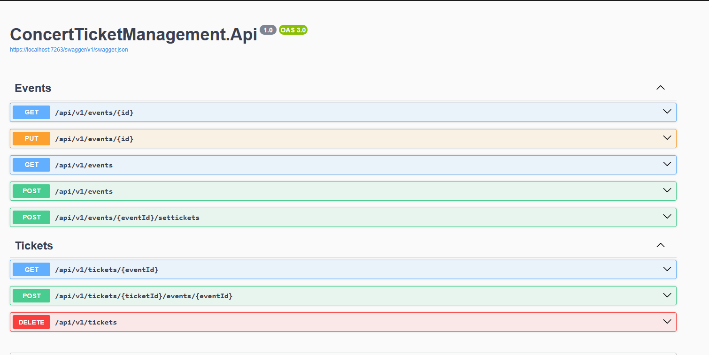

# Concert Ticket Management System

## Core Requirements

### Create a .NET Web API for managing concert tickets with these Core features

• Event Management 
• Ticket Reservations and Sales 
• Venue Capacity Management 

### Domain Features

#### Events  

• Create/update concert events 
• Set ticket types and pricing 
• Manage available capacity 
• Basic event details (date, venue, description)  

#### Tickets  

• Reserve tickets for a time window 
• Purchase tickets (Can assume there is already Payment Processing System in place which you can leverage) 
• Cancel reservations 
• View ticket availability 

